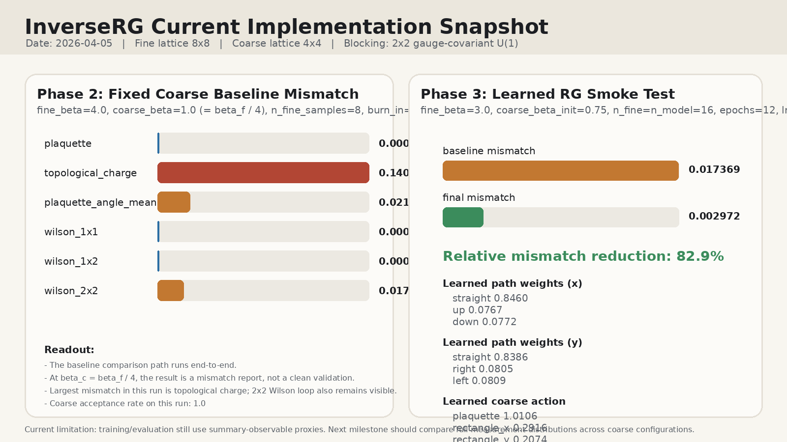

# InverseRG Current Status (2026-04-05)

## Figure

## What Is Implemented
- Fine-theory 2D compact U(1) HMC sampler in `inverserg/hmc.py`.
- Fine/coarse lattice measurement helpers in `inverserg/lattice.py` and `inverserg/measurements.py`.
- Fixed `2x2` gauge-covariant blocker and learnable path-weight blocker in `inverserg/blocking.py`.
- Local coarse action in `inverserg/actions.py` with basis:
  - plaquette
  - rectangle_x (`2x1`)
  - rectangle_y (`1x2`)
- Fine-to-coarse baseline script in `examples/fixed_coarse_baseline.py`.
- Learned blocking plus coarse-action training script in `examples/train_learned_rg.py`.
- `SPEC.md` and `AGNETS.md` documenting scope and collaboration rules.

## What Was Actually Run

### Phase 1 Runtime Check
- Command: `pytest tests/test_lattice_measurements.py -q`
- Result: `6 passed`
- Covered behaviors:
  - angle wrapping via `regularize`
  - zero-field plaquette / topology
  - constant-flux topology case
  - zero-field Wilson loops
  - observable-summary keys
  - basic HMC output shape / regularization smoke test

### Phase 2 Fixed Coarse Baseline
- Script: `examples/fixed_coarse_baseline.py`
- Fine lattice size: `8x8`
- Coarse lattice size after `2x2` blocking: `4x4`
- Fine coupling: `beta_f = 4.0`
- Coarse baseline hypothesis: `beta_c = beta_f / 4 = 1.0`
- Fine sample count: `8`
- Sampler burn-in: `24`
- Sampler thinning: `2`
- HMC settings: `n_steps = 8`, `step_size = 0.15`

The script:
1. generates a fine ensemble,
2. blocks it to a coarse ensemble with the fixed gauge-covariant map,
3. samples a separate coarse Wilson ensemble with HMC,
4. compares summary measurements between the two coarse ensembles.

### Phase 3 Learned RG Smoke Test
- Script: `examples/train_learned_rg.py`
- Fine lattice size: `8x8`
- Coarse lattice size: `4x4`
- Fine coupling: `beta_f = 3.0`
- Coarse initialization: `beta_c = beta_f / 4 = 0.75`
- Fine sample count: `16`
- Coarse model sample count: `16`
- Sampler burn-in: `24`
- Sampler thinning: `2`
- Training epochs: `12`
- Learning rate: `3e-2`
- HMC settings: `n_steps = 8`, `step_size = 0.15`

## How The Current MCRG Is Done
- Blocking factor is fixed to `2x2`.
- For each coarse link direction, the blocker uses three local gauge-covariant path families:
  - x-links: `straight`, `up`, `down`
  - y-links: `straight`, `right`, `left`
- The fixed blocker uses an almost-pure straight-path choice through logits `[[12, -12, -12], [12, -12, -12]]`.
- The learnable blocker starts from logits `[[2, 0, 0], [2, 0, 0]]` and learns softmax weights over those path families.
- Path contributions are combined by circular averaging and projected back to U(1) through angle regularization.

## What Measurements Are Checked On The Coarse Lattice

### Phase 2 Runtime Report
- `plaquette`
- `topological_charge`
- `plaquette_angle_mean`
- `wilson_1x1`
- `wilson_1x2`
- `wilson_2x2`

### Phase 3 Training Proxy
- `plaquette`
- `rectangle_x`
- `rectangle_y`

## Current Numerical Results

### Phase 2 Fixed Coarse Baseline
- blocked-fine observables:
  - `plaquette = 0.460879`
  - `topological_charge = 0.25`
  - `plaquette_angle_mean = 0.098175`
  - `wilson_1x1 = 0.460879`
  - `wilson_1x2 = 0.282451`
  - `wilson_2x2 = 0.187855`
- coarse Wilson observables:
  - `plaquette = 0.430708`
  - `topological_charge = -0.125`
  - `plaquette_angle_mean = -0.049087`
  - `wilson_1x1 = 0.430708`
  - `wilson_1x2 = 0.286863`
  - `wilson_2x2 = 0.055216`
- mismatch report:
  - `plaquette = 9.10e-4`
  - `topological_charge = 1.40625e-1`
  - `plaquette_angle_mean = 2.16861e-2`
  - `wilson_1x1 = 9.10e-4`
  - `wilson_1x2 = 1.95e-5`
  - `wilson_2x2 = 1.75931e-2`
- coarse acceptance rate: `1.0`

Interpretation:
- The current code successfully runs the blocked-fine vs coarse-baseline comparison path.
- At `beta_c = beta_f / 4`, the result is an explicit mismatch report rather than a clean validation of the hypothesis.
- This is acceptable for the current baseline milestone, because the milestone required either validation or an explicit mismatch report.

### Phase 3 Learned RG Smoke Test
- baseline mismatch: `0.017369`
- final mismatch: `0.002972`
- relative reduction: about `82.9%`
- learned blocking weights:
  - x-links: `[0.8460, 0.0767, 0.0772]`
  - y-links: `[0.8386, 0.0805, 0.0809]`
- learned action coefficients:
  - `plaquette = 1.0106`
  - `rectangle_x = 0.2916`
  - `rectangle_y = 0.2074`

Interpretation:
- On this small smoke test, the learned blocker + coarse action improve the current proxy mismatch substantially.
- The learned blocker still favors the straight path strongly, but not exclusively.
- The learned coarse action moves away from pure Wilson by turning on rectangle terms.

## Important Limitation
The current optimization target is still a proxy.

Right now the code mainly compares summary observables or their ensemble means. That is useful for a first implementation pass, but it is not yet the final scientific target clarified by @Greyyy.

The intended target is:
- take the blocked-fine coarse ensemble,
- take the coarse-HMC ensemble,
- compare measurement distributions across configurations,
- and drive those distributions toward consistency.

## Recommended Next Step
The next phase should upgrade both evaluation and training from mean-level matching to distribution-level matching.

Concretely:
1. add per-measurement distribution diagnostics for blocked-fine vs coarse ensembles,
2. add report plots and markdown summaries for those distributions,
3. decide on a distributional objective for training,
4. re-run at more than one `beta_f` and, after that, at larger lattices.
